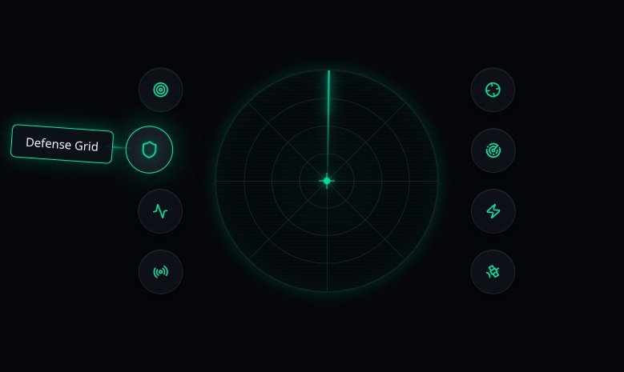

# Futuristic Radar UI Component

[](https://reactjs.org/)
[](https://vitejs.dev/)
[](https://www.typescriptlang.org/)
[](https://tailwindcss.com/)
[](https://opensource.org/licenses/MIT)

## Screenshot



A stunning, interactive futuristic radar navigation component built with React, featuring a central radar display with animated sweep beam, grid overlays, and surrounding menu stacks. Perfect for sci-fi themed applications, dashboards, or any project needing a high-tech UI element.

The project is available on [GitHub](https://github.com/alisacorporation/Futuristic-radar-aim-UI-component).

## Table of Contents

- [Features](#features)
- [Screenshot](#screenshot)
- [Technologies](#technologies)
- [Installation](#installation)
- [Usage](#usage)
- [Scripts](#scripts)
- [Attributions](#attributions)
- [License](#license)

## Features

- **Interactive Radar Display**: Animated radar with sweeping beam, concentric grid rings, and center crosshair
- **Dual Menu Stacks**: Left and right navigation menus with futuristic icons and labels
- **Responsive Design**: Built with modern CSS and responsive principles
- **Accessibility**: Proper ARIA labels and semantic HTML structure
- **Customizable**: Easy to modify colors, icons, and menu items
- **TypeScript Support**: Full type safety with TypeScript definitions
- **Modern Stack**: Built with React 18, Vite, and Tailwind CSS

## Technologies

- **Frontend Framework**: React 18 with TypeScript
- **Build Tool**: Vite
- **Styling**: Tailwind CSS with custom CSS variables
- **Icons**: Lucide React
- **UI Components**: Radix UI primitives (via shadcn/ui)
- **Animation**: CSS animations and transitions

## Installation

1. Clone the repository:
   ```bash
   git clone https://github.com/alisacorporation/Futuristic-radar-aim-UI-component.git
   cd Futuristic-radar-aim-UI-component
   ```

2. Install dependencies:
   ```bash
   npm install
   ```

3. Start the development server:
   ```bash
   npm run dev
   ```

4. Open your browser and navigate to `http://localhost:5173`

## Usage

The main component is `RadarNav` located in `src/components/RadarNav.tsx`. You can import and use it in your React application:

```tsx
import RadarNav from './components/RadarNav';

function App() {
  return (
    <div className="app">
      <RadarNav />
    </div>
  );
}

export default App;
```

### Customization

- **Menu Items**: Modify the `leftMenuItems` and `rightMenuItems` arrays in `RadarNav.tsx`
- **Styling**: Adjust colors and animations in `RadarNav.css`
- **Icons**: Replace Lucide icons with your preferred icon set

## Scripts

- `npm run dev` - Start the development server
- `npm run build` - Build the project for production

## Attributions

This project includes components from [shadcn/ui](https://ui.shadcn.com/) used under the [MIT license](https://github.com/shadcn-ui/ui/blob/main/LICENSE.md).

Photos used in this project are from [Unsplash](https://unsplash.com) and are used under their [license](https://unsplash.com/license).

## Release

**MD5 Hash**: `335340913bc0b210a9030aac64cc73db`

## License

This project is licensed under the MIT License - see the [LICENSE](LICENSE) file for details.
